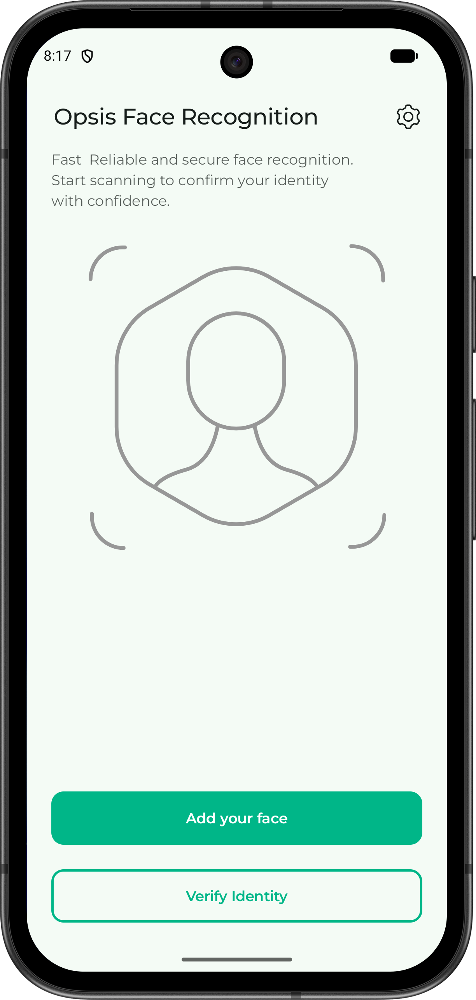
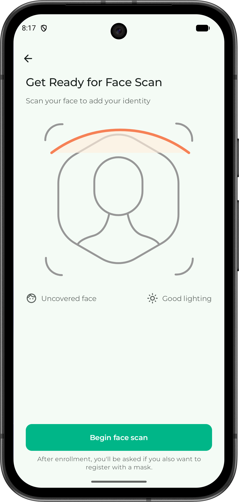
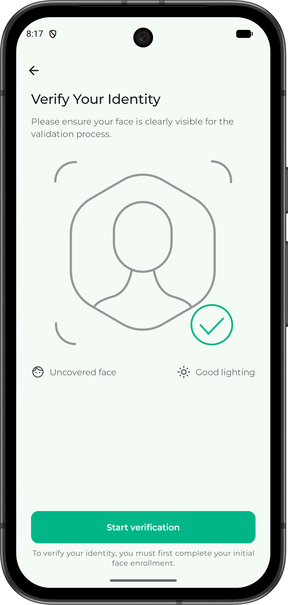
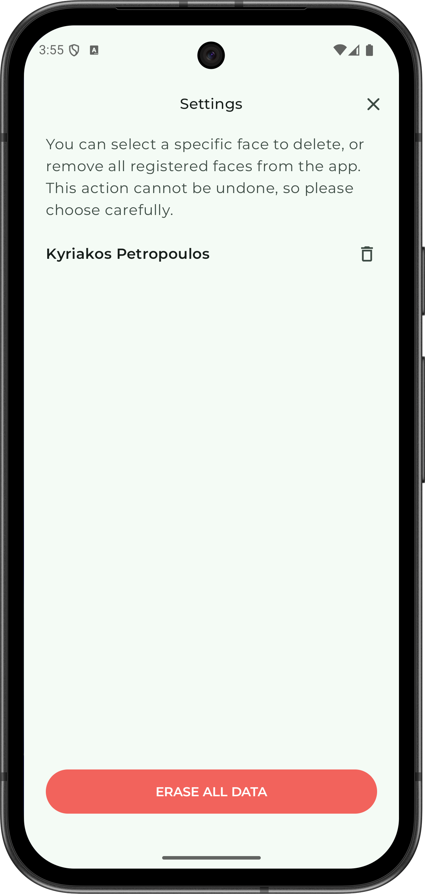

# Opsis Face Recognition

[](https://kotlinlang.org/)
[](https://developer.android.com/jetpack/compose)
[](https://developers.google.com/ml-kit/vision/face-detection)
[](https://github.com/sirius-ai/MobileFaceNet_TF)
[](https://developer.android.com/training/camerax)
[](https://dagger.dev/hilt/)
[](https://developer.android.com/jetpack/androidx/releases/room)

An Android face recognition app built with Jetpack Compose.  
This is a student project that demonstrates a complete flow for:

- Face enrollment
- Face verification
- Local embedding storage
- User management from settings

<p float="left">
  
  
  
  
</p>

## What The App Does

The app opens the camera, detects a face with ML Kit, and when conditions are good it:

- captures 4 face samples
- computes an embedding with MobileFaceNet (`mobilefacenet.tflite`)
- stores the embedding and name in Room DB

In verification mode, it:

- computes an embedding from a new scan
- compares it with all stored users (cosine similarity)
- accepts the best match only if score is >= `verification_threshold` (currently `0.82`)

## Stack / Technologies

- Kotlin + Jetpack Compose (Material 3)
- CameraX (`camera-core`, `camera-camera2`, `camera-lifecycle`, `camera-view`)
- Google ML Kit Face Detection
- LiteRT + TensorFlow Lite Support API (MobileFaceNet inference)
- Room Database
- SQLCipher (encrypted Room database)
- Hilt (DI)
- Navigation Compose

## Project Structure

- `ui/`: app screens (Home, Prep, Scanner, Enroll, Success/Failed, Settings)
- `core/`: camera preview, analyzer, scanner config, permission handling, shared UI components
- `domain/`: models, repository contracts, use cases
- `data/`: Room entities, DAO, repository implementation
- `navigation/`: routes and nav graph
- `viewmodel/`: UI state management for scanner and settings

Main code points:

- `app/src/main/java/com/example/opsisfacerecognition/core/biometrics/FaceAnalyzer.kt`
- `app/src/main/java/com/example/opsisfacerecognition/core/biometrics/MobileFaceNetLiteRT.kt`
- `app/src/main/java/com/example/opsisfacerecognition/viewmodel/FaceRecognizerViewModel.kt`
- `app/src/main/java/com/example/opsisfacerecognition/viewmodel/SettingsViewModel.kt`

## User Flow

1. From Home, choose `Start face scan` (enroll) or `Verify identity`.
2. Grant camera permission.
3. In scanner, follow instructions (center face, look straight, hold still).
4. In enrollment, after capture, enter full name.
5. If full name already exists, a conflict message is shown.
6. In verification, the app matches against stored users.
7. If verification succeeds, the matched user name is displayed.
8. From Settings, delete one user or erase all stored data.

## Scanner Quality Checks

Before accepting samples, the analyzer checks:

- exactly one face
- face inside the oval guide
- near-straight orientation (yaw/pitch/roll up to ~12 degrees)
- stability for ~600ms
- sufficient eye distance
- pseudo-liveness blink challenge (open -> closed -> open eyes)
- anti-blur check (Laplacian variance)

Then it captures 4 samples and computes average embedding + L2 normalization.

## Data Storage

Encrypted Room DB (`app.db`) with SQLCipher, table `users`

- `localId` (auto)
- `userId` (UUID)
- `fullName`
- `embedding` (`FloatArray`, converted to `ByteArray`)

Database passphrase is generated per install and protected via Android Keystore.

No backend is used. Data stays locally on device.

## Environment Requirements

- Android Studio (latest stable recommended)
- Android SDK with `minSdk = 24`, `targetSdk = 36`, `compileSdk = 36`
- JDK 11

## Build / Run

From Android Studio:

1. Open the project.
2. Wait for Gradle Sync.
3. Run on emulator or physical device with camera.

From terminal:

```bash
./gradlew assembleDebug
```

To install on a connected device:

```bash
./gradlew installDebug
```

## Tests

Currently only basic template tests exist:

- `app/src/test/.../ExampleUnitTest.kt`
- `app/src/androidTest/.../ExampleInstrumentedTest.kt`

There is no full test coverage yet for biometrics and UI flows.

## Important Notes

- This project is for educational/experimental use.
- It includes pseudo-liveness using a blink challenge, but this is not a production-grade anti-spoofing solution.
- `verification_threshold` is currently `0.82` (in `VerifyUserUseCase`), based on initial self-tests, and needs further testing/calibration with more users.
- Existing plaintext DB is reset once when encrypted DB is initialized (no migration strategy).

## Extra Material

Sequence diagrams are available in:

- `design/uml/sequence/registration-standard.puml`
- `design/uml/sequence/registration-name-conflict.puml`
- `design/uml/sequence/verify.puml`
- `design/uml/sequence/delete-face.puml`
