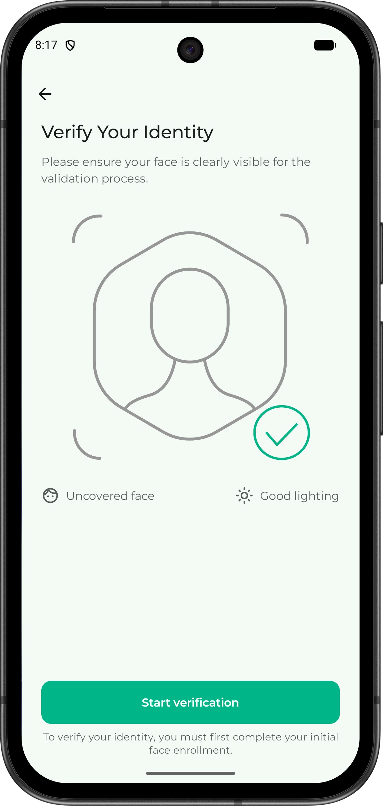

# Opsis Face Recognition

[](https://kotlinlang.org/)
[](https://developer.android.com/jetpack/compose)
[](https://developers.google.com/ml-kit/vision/face-detection)
[](https://github.com/sirius-ai/MobileFaceNet_TF)
[](https://www.tensorflow.org/api_docs/python/tf/keras/applications/MobileNetV2)
[](https://github.com/AliaksandrSiarohin/first-order-model)
[](https://developer.android.com/training/camerax)
[](https://dagger.dev/hilt/)
[](https://developer.android.com/jetpack/androidx/releases/room)

An Android face recognition app built with Jetpack Compose.

- Face enrollment
- Face verification
- Local embedding storage
- User management from settings
- On-device face attribute detection (glasses, hat)
- Passive liveness detection (anti-spoofing)

<p float="left">
  
  
  
  
</p>

## What The App Does

The app opens the camera, detects a face with ML Kit, and when conditions are good it:

- captures 4 face samples
- computes an embedding with MobileFaceNet (`mobilefacenet.tflite`)
- stores the embedding and name in Room DB

In verification mode, it:

- computes an embedding from a new scan
- compares it with all stored users (cosine similarity)
- accepts the best match only if score is >= `verification_threshold` (currently `0.82`)

## Stack / Technologies

- Kotlin + Jetpack Compose (Material 3)
- CameraX (`camera-core`, `camera-camera2`, `camera-lifecycle`, `camera-view`)
- Google ML Kit Face Detection
- LiteRT + TensorFlow Lite Support API (MobileFaceNet inference, face attribute classification)
- ONNX Runtime for Android (passive liveness inference)
- Room Database
- SQLCipher (encrypted Room database)
- Hilt (DI)
- Navigation Compose

## Project Structure

- `ui/`: app screens (Home, Prep, Scanner, Enroll, Success/Failed, Settings)
- `core/`: camera preview, analyzer, scanner config, permission handling, shared UI components
- `domain/`: models, repository contracts, use cases
- `data/`: Room entities, DAO, repository implementation
- `navigation/`: routes and nav graph
- `viewmodel/`: UI state management for scanner and settings

Main code points:

- `app/src/main/java/com/example/opsisfacerecognition/core/biometrics/FaceAnalyzer.kt`
- `app/src/main/java/com/example/opsisfacerecognition/core/biometrics/MobileFaceNetLiteRT.kt`
- `app/src/main/java/com/example/opsisfacerecognition/core/biometrics/FaceAttributeClassifier.kt`
- `app/src/main/java/com/example/opsisfacerecognition/core/biometrics/LivenessDetector.kt`
- `app/src/main/java/com/example/opsisfacerecognition/viewmodel/FaceRecognizerViewModel.kt`
- `app/src/main/java/com/example/opsisfacerecognition/viewmodel/SettingsViewModel.kt`

## User Flow

1. From Home, choose `Start face scan` (enroll) or `Verify identity`.
2. Grant camera permission.
3. In scanner, follow instructions (center face, look straight, hold still).
4. In enrollment, after capture, enter full name.
5. If full name already exists, a conflict message is shown.
6. In verification, the app matches against stored users.
7. If verification succeeds, the matched user name is displayed.
8. From Settings, delete one user or erase all stored data.

## Scanner Quality Checks

Before accepting samples, the analyzer checks:

- exactly one face
- face inside the oval guide
- near-straight orientation (yaw/pitch/roll up to ~12 degrees)
- stability for ~600ms
- sufficient eye distance
- both eyes open
- no eyeglasses or hat detected (via on-device `face_attributes.tflite` model)
- passive liveness check (via on-device SilentFace ONNX models)
- anti-blur check (Laplacian variance)

Then it captures 4 samples and computes average embedding + L2 normalization.

## Face Attribute Classification

ML Kit does not provide eyeglasses or hat detection. To enforce bare-face capture, a custom binary classifier was trained and deployed on-device.

- **Dataset**: [CelebA](http://mmlab.ie.cuhk.edu.hk/projects/CelebA.html) (~202,000 aligned face images, 40 binary attributes)
- **Attributes used**: `Eyeglasses`, `Wearing_Hat`
- **Architecture**: MobileNetV2 (ImageNet weights, frozen) + GlobalAveragePooling + Dense(128, ReLU) + Dropout(0.3) + Dense(2, Sigmoid)
- **Input**: 96×96 RGB face crop, normalized to [0, 1]
- **Output**: `[glasses_prob, hat_prob]` — independent sigmoid probabilities
- **Export**: converted to TFLite (`face_attributes.tflite`) and bundled in `assets/`
- **Inference**: runs every 500ms on the face bounding box crop; result is cached and applied every frame to block capture

Training notebook: `ml/train_face_attributes.ipynb` (designed for Google Colab).

## Passive Liveness Detection

To prevent spoofing attacks (printed photos, screens, masks), a passive liveness check runs on every candidate frame before samples are accepted. No user action is required.

- **Models**: two SilentFace ONNX models (`silentface40.onnx`, `silentface27.onnx`) run in parallel — one on a wider crop (scale 4.0×) and one on a tighter crop (scale 2.7×) of the face bounding box
- **Input**: 80×80 RGB crop, raw pixel values [0, 255], CHW layout
- **Output**: softmax over two classes (spoof / live); index 1 is the live score
- **Decision**: the two live scores are averaged and compared against a threshold (`0.972`); both crops must agree the face is real
- **Runtime**: ONNX Runtime for Android (`onnxruntime-android:1.24.2`)
- **Inference**: runs every 500ms together with face attribute classification; result is cached and applied every frame to block capture


## Data Storage

Encrypted Room DB (`app.db`) with SQLCipher, table `users`

- `localId` (auto)
- `userId` (UUID)
- `fullName`
- `embedding` (`FloatArray`, converted to `ByteArray`)

Database passphrase is generated per install and protected via Android Keystore.

No backend is used. Data stays locally on device.

## Environment Requirements

- Android Studio (latest stable recommended)
- Android SDK with `minSdk = 24`, `targetSdk = 36`, `compileSdk = 36`
- JDK 11

## Build / Run

From Android Studio:

1. Open the project.
2. Wait for Gradle Sync.
3. Run on emulator or physical device with camera.

From terminal:

```bash
./gradlew assembleDebug
```

To install on a connected device:

```bash
./gradlew installDebug
```

## Tests

Currently only basic template tests exist:

- `app/src/test/.../ExampleUnitTest.kt`
- `app/src/androidTest/.../ExampleInstrumentedTest.kt`

There is no full test coverage yet for biometrics and UI flows.

## Important Notes

- `verification_threshold` is currently `0.82` (in `VerifyUserUseCase`), based on initial self-tests, and needs further testing/calibration with more users.
- Existing plaintext DB is reset once when encrypted DB is initialized (no migration strategy).
