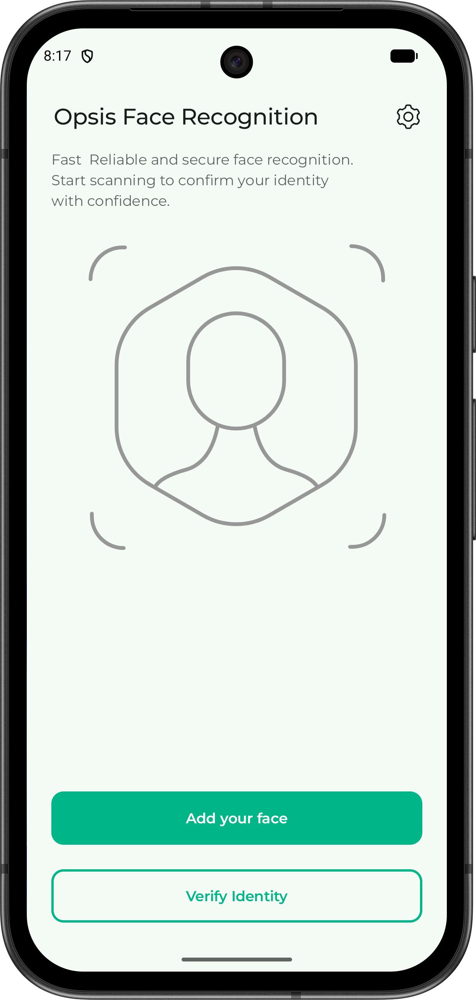
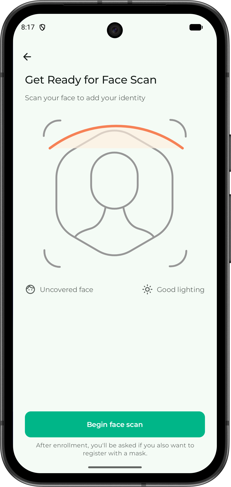
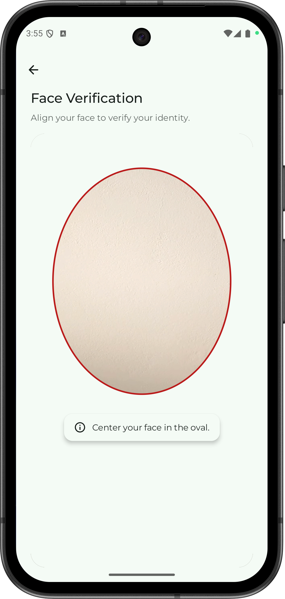
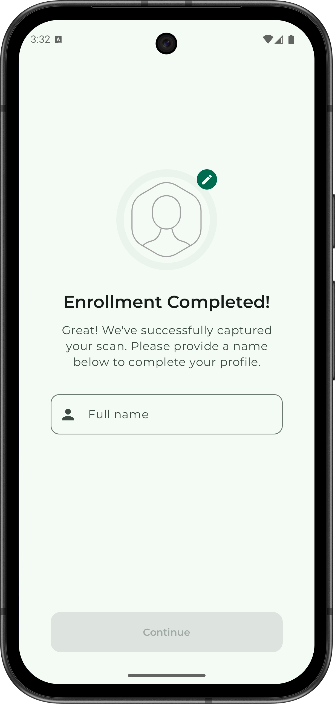
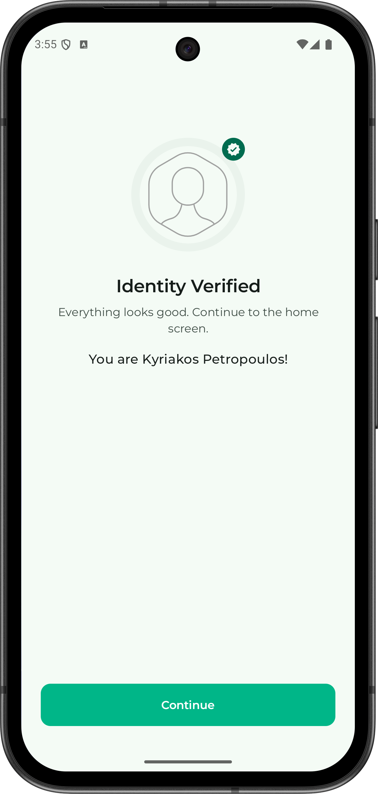
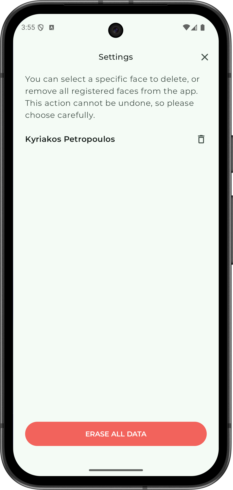

# Opsis Face Recognition

[](https://kotlinlang.org/)
[](https://developer.android.com/jetpack/compose)
[](https://developers.google.com/ml-kit/vision/face-detection)
[](https://github.com/sirius-ai/MobileFaceNet_TF)
[](https://www.tensorflow.org/api_docs/python/tf/keras/applications/MobileNetV2)
[](https://github.com/minivision-ai/Silent-Face-Anti-Spoofing)
[](https://developer.android.com/training/camerax)
[](https://dagger.dev/hilt/)
[](https://developer.android.com/jetpack/androidx/releases/room)
[](https://www.zetetic.net/sqlcipher/)

A fully on-device face recognition app for Android. Enrollment and verification run entirely on the device with no network calls. Biometric templates never leave local storage.

<div>
  
  
  
  
  
  
</div>

## Highlights

- **On-device biometric pipeline** combining ML Kit detection, MobileFaceNet embeddings (LiteRT), a custom attribute classifier (MobileNetV2 trained on CelebA), and a SilentFace anti-spoofing ensemble (ONNX Runtime).
- **Encrypted local storage** with SQLCipher and an AES/GCM passphrase wrapped by a non-exportable Android Keystore key.
- **Clean Architecture** (domain / data / ui), Hilt with Assisted Injection, state-driven UI via sealed `FaceUiState`, unidirectional data flow in Compose.
- **Tablet-aware layout** through `WindowSizeClass` — gutters, max content width, and vertical centering adapt without duplicating screens.
- **Explicit quality gates** before any embedding is stored: pose, framing, stability, eye openness, attribute hygiene, passive liveness, and Laplacian-variance blur rejection.

## Technology Stack

| Layer        | Choice |
|--------------|--------|
| UI           | Jetpack Compose (Material 3), Navigation Compose, Material3 Window Size Class |
| Camera       | CameraX (`core`, `camera2`, `lifecycle`, `view`) |
| Detection    | Google ML Kit Face Detection (fast mode, classification, landmarks, tracking) |
| Embedding    | MobileFaceNet via LiteRT + TensorFlow Lite Support |
| Attributes   | Custom MobileNetV2 classifier (TFLite), GPU delegate with CPU fallback |
| Liveness     | SilentFace dual-model ensemble (ONNX Runtime), NNAPI acceleration with CPU fallback |
| Persistence  | Room 2.8.4 + SQLCipher 4.5.4 |
| Security     | Android Keystore (AES/GCM, 256-bit, non-exportable) |
| DI           | Hilt (KSP), Assisted Injection for the analyzer |
| Target       | `minSdk 24`, `targetSdk 36`, `compileSdk 36`, JDK 11 |

## Architecture

```
app/
├── ui/                     Compose screens (Home, Prep, Scanner, Enroll, Success, Settings)
├── core/
│   ├── biometrics/         FaceAnalyzer, LiteRT, LivenessDetector, FaceAttributeClassifier,
│   │                       FaceValidation, FaceSampleCollector, FaceCaptureSession
│   ├── config/             Scanner geometry / tuning constants
│   ├── permissions/        Declarative camera permission requester
│   ├── states/             FaceUiState, FaceFlowMode, SettingsUiState
├── domain/
│   ├── model/              Pure Kotlin models (User)
│   ├── repository/         Repository contracts
│   └── usecase/            Enroll, Verify, ComputeEmbedding, ListUsers, Delete…
├── data/
│   ├── local/              Room DB, DAO, entities, passphrase provider
│   └── repository/         UserRepositoryImpl
├── di/                     Hilt modules (Biometrics, Database, Repository)
├── navigation/             Routes + NavGraph
└── viewmodel/              FaceRecognizerViewModel, SettingsViewModel
```

PlantUML diagrams (architecture, sequences, ER, ML pipeline, state machine) live under `docs/uml/`.

## Biometric Pipeline

Each camera frame passes through `FaceAnalyzer`, which delegates to single-responsibility collaborators and short-circuits as soon as a gate fails.

1. **Detection** – ML Kit returns faces with landmarks, head Euler angles, and a tracking ID.
2. **Framing** – A single face must be centred inside the on-screen oval with `faceWidth` within `[0.45, 2.20] × ovalRadiusX`.
3. **Pose** – Yaw/roll ≤ 15°, pitch ≤ 20° (pitch is more lenient because users look slightly down at their phone).
4. **Identity continuity** – The ML Kit tracking ID must persist across frames; a change resets capture state to avoid mixing samples from two people.
5. **Eye openness** – Both eyes ≥ 0.40 probability.
6. **Stability** – The face must hold a valid state for 600 ms before capture begins.
7. **Attribute hygiene** – A MobileNetV2 head predicts `[glasses, hat]`. Two consecutive positive readings (sampled every 300 ms) block capture.
8. **Passive liveness** – Two SilentFace models (80×80 CHW, scale 4.0× and 2.7×) score the frame in parallel, their live probabilities are averaged and thresholded at 0.97. Two consecutive failures block capture.
9. **Alignment & blur** – The candidate frame is warped with a similarity transform so the eyes land on fixed coordinates in a 112×112 crop. A single-pass Laplacian variance (> 160) rejects motion blur.
10. **Capture** – Three aligned crops are accumulated at 350 ms intervals.
11. **Embedding** – Each crop is embedded with MobileFaceNet; vectors are L2-normalised, averaged, and re-normalised.
12. **Decision**
    - Enroll: store `{userId, fullName, embedding}`.
    - Verify: cosine similarity against every stored template; accept if the best score ≥ `0.82`.

All heavy work runs off the main thread; bitmaps are recycled in `finally` blocks to prevent leaks.

## Face Attribute Classifier

ML Kit does not expose glasses or hat detection, so a custom binary classifier was trained and deployed on-device.

- **Dataset:** [CelebA](http://mmlab.ie.cuhk.edu.hk/projects/CelebA.html) (~202k aligned faces, 40 binary attributes).
- **Attributes used:** `Eyeglasses`, `Wearing_Hat`.
- **Architecture:** MobileNetV2 (ImageNet weights, frozen) → GlobalAveragePooling → Dense(128, ReLU) → Dropout(0.3) → Dense(2, Sigmoid).
- **Input:** 96×96 RGB crop, normalised to `[0, 1]`.
- **Output:** independent sigmoid probabilities; threshold 0.50 per attribute.
- **Export:** converted to `face_attributes.tflite` and bundled under `assets/`.
- **Runtime:** LiteRT with GPU accelerator, graceful CPU fallback if the delegate fails to initialise.

Training notebook: `ml/train_face_attributes.ipynb` (Google Colab).

## Passive Liveness

- **Models:** `silentface40.onnx` (wider crop, scale 4.0×) and `silentface27.onnx` (tighter crop, scale 2.7×), run as an ensemble.
- **Input:** 80×80 RGB, CHW layout, raw `[0, 255]` pixel values.
- **Output:** softmax over `{spoof, live}`; live probabilities are averaged across both models.
- **Decision:** `average ≥ 0.97`. Both models must produce a valid crop — if either fails (e.g. the bounding box is too close to the frame edge), the check is rejected. The dual-scale ensemble is the whole point, so we don't silently fall back to a single model on a security check.
- **Runtime:** ONNX Runtime for Android 1.24.2 with NNAPI execution provider, falling back to CPU silently.

## Security & Data

- **Templates only:** raw images never leave the camera thread; only averaged, L2-normalised 128-d embeddings are persisted.
- **Encrypted database:** Room over SQLCipher (`app.db`), schema: `users(localId, userId, fullName, embedding: ByteArray)`.
- **Passphrase management:** a 32-byte passphrase is generated on first launch with `SecureRandom`, encrypted with an AES/GCM 256-bit key that lives in `AndroidKeyStore`, and stored as ciphertext + IV in private `SharedPreferences`. The raw key is never exportable.
- **No backend:** everything is local, the app has no internet permission in its manifest beyond what CameraX and ML Kit require.

## User Flow

1. From Home, pick **Add your face** or **Verify identity**.
2. Grant camera permission (rationale and settings fallbacks are handled declaratively).
3. The scanner guides the user with granular feedback ("center your face", "don't tilt your head", "remove glasses", …) until a valid capture window is reached.
4. On enroll, the user enters a full name; duplicates are rejected.
5. On verify, the best-matching user is returned when the cosine similarity crosses the threshold.
6. Settings allows single-user deletion or a full wipe.

## Tuning Constants

Centralised for easy calibration:

| Constant | Value | Location |
|---|---|---|
| Verification threshold | `0.82` | `VerifyUserUseCase` |
| Liveness threshold | `0.97` | `LivenessDetector` |
| Attribute thresholds | `0.50` | `FaceAttributeClassifier` |
| Stability duration | `600 ms` | `FaceAnalyzer` |
| Attribute/liveness cadence | `300 ms` | `FaceAnalyzer` |
| Consecutive failures required | `2` | `FaceAnalyzer` |
| Blur variance threshold | `160` | `FaceSampleCollector` |
| Feedback switch cooldown | `800 ms` | `DetectionFeedbackEmitter` |
| Yaw / roll / pitch limits | `15° / 15° / 20°` | `FaceValidation` |
| Target samples per capture | `3` | `FaceSampleCollector` |
| Aligned crop size | `112×112` | `FaceSampleCollector` |

## Build & Run

Prerequisites: Android Studio (latest stable), JDK 11, a device or emulator with a camera.

```bash
./gradlew assembleDebug      # build
./gradlew installDebug       # install on a connected device
```

From Android Studio: open the project, let Gradle sync, run the `app` configuration.

## Tests

Template unit and instrumented test stubs exist under `app/src/test/` and `app/src/androidTest/`. End-to-end coverage of the biometric pipeline and UI flows is intentionally out of scope for this release — the analyzer's collaborators (`FaceValidation`, `FaceSampleCollector`, `LivenessDetector`, `FaceAttributeClassifier`) are factored as pure, injectable units, which keeps them testable in follow-up work.

## Notes & Limitations

- `verification_threshold = 0.82` is calibrated against a small in-house set. A larger enrollment corpus is needed to pin down the FAR/FRR curve.
- SQLCipher migration on a pre-existing plaintext database is handled by a one-time reset — no schema upgrade path yet.
- The classifier was trained on CelebA, which skews toward celebrity demographics. Fairness across skin tones and eyewear styles has not been formally evaluated.
