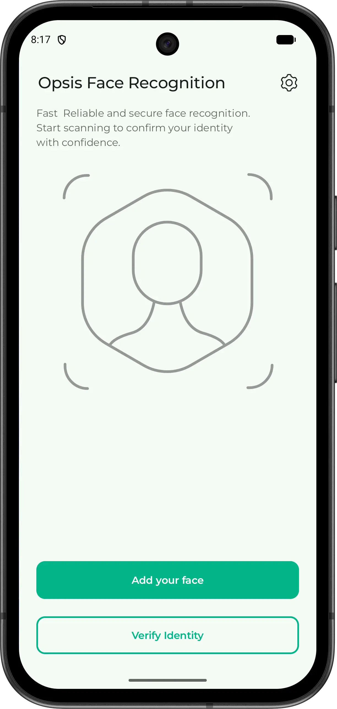
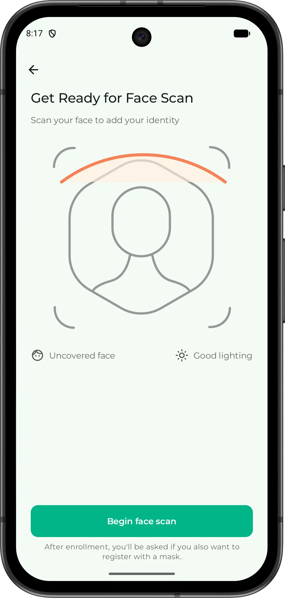
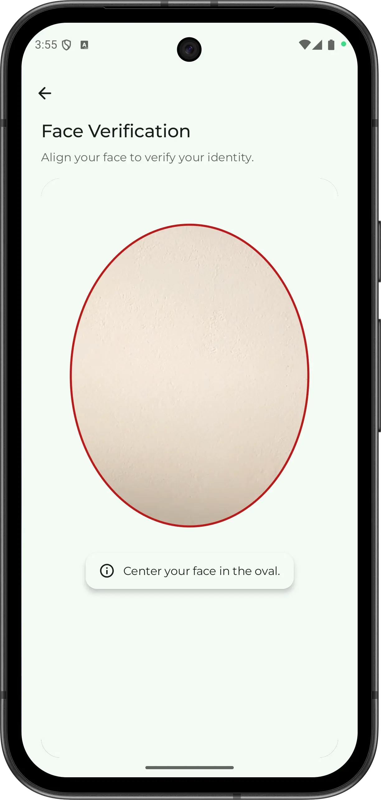
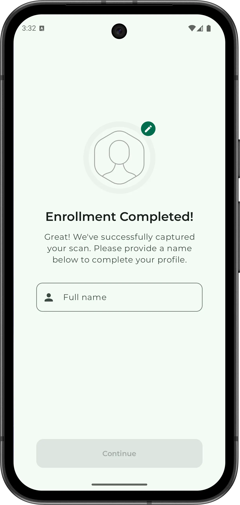
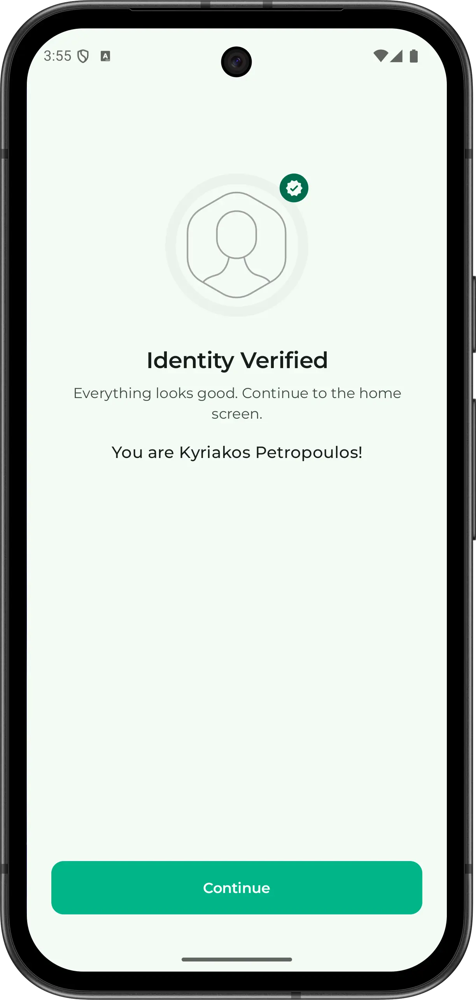
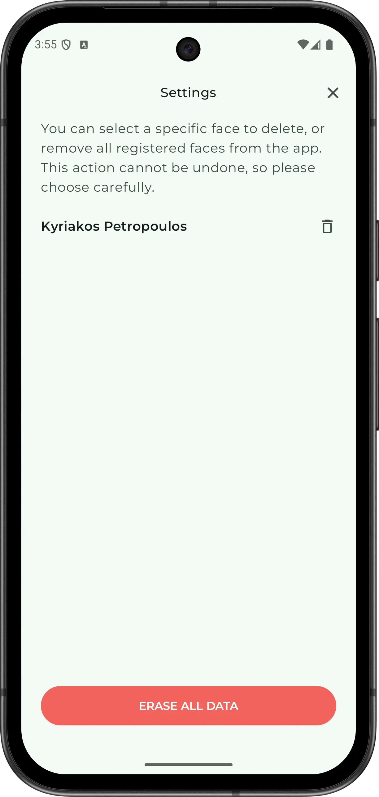

# Opsis

[](https://kotlinlang.org/)
[](https://developer.android.com/jetpack/compose)
[](https://developers.google.com/ml-kit/vision/face-detection)
[](https://github.com/sirius-ai/MobileFaceNet_TF)
[](https://www.tensorflow.org/api_docs/python/tf/keras/applications/MobileNetV2)
[](https://github.com/minivision-ai/Silent-Face-Anti-Spoofing)
[](https://developer.android.com/training/camerax)
[](https://dagger.dev/hilt/)
[](https://developer.android.com/jetpack/androidx/releases/room)
[](https://www.zetetic.net/sqlcipher/)

Opsis is an Android application for private biometric enrollment and identity verification. It turns a phone into a self-contained face recognition system: camera analysis, face embedding, passive liveness detection, attribute checks, and encrypted template storage all run locally.

The project focuses on a privacy-preserving face recognition flow suitable for an academic thesis prototype. No backend service is used, no raw camera frames are persisted, and biometric templates remain inside an encrypted local Room database.

<div>
  
  
  
  
  
  
</div>

## At a Glance

| Area                | What this project demonstrates                                                                |
|---------------------|-----------------------------------------------------------------------------------------------|
| Computer vision     | Real-time face detection, pose/framing validation, alignment, blur rejection                  |
| Machine learning    | MobileFaceNet embeddings, MobileNetV2 attribute classification, SilentFace anti-spoofing      |
| Android engineering | CameraX analysis pipeline, Jetpack Compose UI, Hilt, Room, clean state handling               |
| Security & privacy  | On-device processing, SQLCipher storage, Android Keystore-protected passphrase                |
| Product polish      | Guided scanner feedback, responsive layouts, settings flow, screenshots and UML documentation |

## Project Goals

- Provide a complete enrollment and verification flow with clear user guidance.
- Keep all biometric processing and storage on the Android device.
- Combine face recognition with quality checks, attribute hygiene, and passive liveness detection.
- Structure the app with maintainable Android architecture: Compose UI, ViewModels, use cases, repositories, and dependency injection.
- Document the system with screenshots and UML diagrams for thesis review.

## Key Features

- **On-device biometric pipeline** combining ML Kit detection, MobileFaceNet embeddings (LiteRT), a custom attribute classifier (MobileNetV2 trained on CelebA), and a SilentFace anti-spoofing ensemble (ONNX Runtime).
- **Encrypted local storage** with SQLCipher and an AES/GCM passphrase wrapped by a non-exportable Android Keystore key.
- **Clean Architecture** (domain / data / ui), Hilt with Assisted Injection, state-driven UI via sealed `FaceUiState`, unidirectional data flow in Compose.
- **Tablet-aware layout** through `WindowSizeClass`, with gutters, max content width, and vertical centering that adapt without duplicating screens.
- **Explicit quality gates** before any embedding is stored: pose, framing, stability, eye landmark alignment, attribute hygiene, passive liveness, and Laplacian-variance blur rejection.

## Technology Stack

| Layer       | Choice                                                                              |
|-------------|-------------------------------------------------------------------------------------|
| UI          | Jetpack Compose (Material 3), Navigation Compose, Material3 Window Size Class       |
| Camera      | CameraX (`core`, `camera2`, `lifecycle`, `view`)                                    |
| Detection   | Google ML Kit Face Detection (fast mode, classification, landmarks, tracking)       |
| Embedding   | MobileFaceNet via LiteRT + TensorFlow Lite Support                                  |
| Attributes  | Custom MobileNetV2 classifier (TFLite), GPU delegate with CPU fallback              |
| Liveness    | SilentFace dual-model ensemble (ONNX Runtime), NNAPI acceleration with CPU fallback |
| Persistence | Room 2.8.4 + SQLCipher 4.5.4                                                        |
| Security    | Android Keystore (AES/GCM, 256-bit, non-exportable)                                 |
| DI          | Hilt (KSP), Assisted Injection for the analyzer                                     |
| Target      | `minSdk 24`, `targetSdk 36`, `compileSdk 36`, JDK 11                                |

## Architecture

```
app/
├── app/
│   ├── MainActivity.kt
│   └── ui/                 Shared Compose components, layout containers, dialogs, theme
├── ui/                     Feature screens (Home, Prep, Scanner, Enroll, Success, Settings)
├── core/
│   ├── biometrics/         FaceAnalyzer, LiteRT, LivenessDetector, FaceAttributeClassifier,
│   │                       FaceValidation, FaceSampleCollector, FaceCaptureSession,
│   │                       DetectionFeedbackEmitter, LightingDetector
│   ├── config/             Scanner geometry / tuning constants
│   ├── permissions/        Declarative camera permission requester
│   ├── states/             FaceUiState, FaceFlowMode, SettingsUiState
├── domain/
│   ├── model/              Pure Kotlin models (User)
│   ├── repository/         Repository contracts
│   └── usecase/            Enroll, Verify, ComputeEmbedding, ListUsers, Delete
├── data/
│   ├── local/              Room DB, DAO, entities, passphrase provider
│   └── repository/         UserRepositoryImpl
├── di/                     Hilt modules (Biometrics, Database, Repository)
├── navigation/             Routes + NavGraph
└── viewmodel/              FaceRecognizerViewModel, SettingsViewModel
```

PlantUML diagrams for architecture, sequences, the database model, ML pipeline, and state machine live under `docs/uml/`.

## Biometric Pipeline

Each camera frame passes through `FaceAnalyzer`, which delegates to single-responsibility collaborators and short-circuits as soon as a gate fails.

1. **Detection.** ML Kit returns faces with landmarks, head Euler angles, and a tracking ID.
2. **Framing.** A single face must be centred inside the on-screen oval with `faceWidth` within `[0.45, 2.20] × ovalRadiusX`.
3. **Pose.** Yaw/roll ≤ 15°, pitch ≤ 20°. Pitch is more lenient because users look slightly down at their phone.
4. **Identity continuity.** The ML Kit tracking ID must persist across frames. A change resets capture state to avoid mixing samples from two people.
5. **Eye landmarks.** ML Kit eye landmarks must be available so the final crop can be aligned consistently.
6. **Stability.** The face must hold a valid state for 600 ms before capture begins. 
7. **Blur & lighting.** A single-pass Laplacian variance (> 90) rejects motion blur, while mean luminance separates low-light (< 95) and over-bright (> 160) conditions. Lighting is evaluated first in the pipeline because it directly affects the reliability of both attribute classification and liveness detection. Persistent warnings are only shown after four consecutive positive readings and clear after two clean readings.
8. **Attribute hygiene.** A MobileNetV2 head predicts `[glasses, hat]`. Positive readings sampled every 500 ms silently pause capture immediately, while UI warnings follow the same approach with blur & lighting.
9. **Passive liveness.** Two SilentFace models (80×80 CHW, scale 4.0× and 2.7×) score the frame in parallel. Their live probabilities are averaged and thresholded at 0.93. Failed checks silently pause capture, while UI warnings follow the same approach with lighting and attributes.
10. **Alignment.** The candidate frame is warped with a similarity transform so the eyes land on fixed coordinates in a 112×112 crop.
11. **Capture.** Three aligned crops are accumulated at 350 ms intervals.
12. **Embedding.** Each crop is embedded with MobileFaceNet, then the capture set is converted into four L2-normalized templates: original, exposure-normalized, gamma-darkened, and luminance-equalized.
13. **Decision**
    - Enroll: store `{userId, fullName, embeddingTemplates}`.
    - Verify: cosine similarity across every probe/stored template pair, accept if the best score ≥ `0.74`.

All heavy work runs off the main thread, bitmaps are recycled in `finally` blocks to prevent leaks.

## Face Attribute Classifier

ML Kit does not provide eyewear or headwear detection. To enforce a bare-face enrollment policy and improve biometric template quality, a custom on-device classifier was trained to detect eyeglasses and hats.

- Dataset: CelebA (~202k aligned face images, 40 binary attributes).
- Target attributes: `Eyeglasses`, `Wearing_Hat`.
- Architecture: MobileNetV2 transfer-learning model with a lightweight classification head.
- Input: 96×96 RGB face crop, normalized to `[0,1]`.
- Output: independent probabilities for glasses and hats (threshold = 0.50).
- Deployment: exported as `face_attributes.tflite` and bundled with the application.
- Runtime: LiteRT with GPU acceleration and automatic CPU fallback.

Training notebook: `ml/train_face_attributes.ipynb` (Google Colab).

## Passive Liveness Detection

To reduce presentation attacks, the application performs passive liveness detection before enrollment or verification.

- **Models:** SilentFace ensemble (`silentface40.onnx` and `silentface27.onnx`) operating on different face-crop scales.
- **Inference strategy:** both models evaluate the same face region and their live probabilities are averaged.
- **Decision threshold:** verification proceeds only when the combined liveness score exceeds `0.93`.
- **Fail-safe behavior:** both models must successfully process the face crop. If either model cannot produce a valid result, the liveness check is rejected.
- **User experience:** scanner feedback incorporates hysteresis and lighting-priority rules to reduce UI flicker during borderline conditions.
- **Runtime:** ONNX Runtime for Android with NNAPI acceleration and automatic CPU fallback.

## Security & Data Protection

- **Template-only storage:** raw camera frames are processed in memory and are never persisted. Only L2-normalized face embedding templates are stored.
- **Encrypted database:** biometric templates are stored in a SQLCipher-encrypted Room database (`app.db`).
- **Keystore-backed key management:** on first launch, a random 32-byte database passphrase is generated with `SecureRandom`. The passphrase is encrypted using a non-exportable AES/GCM key stored in Android Keystore and persisted only as ciphertext and IV in private `SharedPreferences`.
- **On-device processing:** face detection, embedding generation, attribute classification, and passive liveness checks execute entirely on the device.
- **No backend services:** the application does not transmit biometric data or communicate with remote servers. The Android manifest requests camera access only and does not include internet permissions.

## User Flow

1. From Home, pick **Add your face** or **Verify identity**.
2. Grant camera permission (rationale and settings fallbacks are handled declaratively).
3. The scanner guides the user with granular feedback, such as "Hold still...", "Keep your head straight.", and "Please remove glasses to continue.", until a valid capture window is reached.
4. On enroll, the user enters a full name, duplicates are rejected.
5. On verify, the best-matching user is returned when the cosine similarity crosses the threshold.
6. Settings allows single-user deletion or a full wipe.

## Tuning Constants

Centralised for easy calibration:

| Constant                       | Value                           | Location                   |
|--------------------------------|---------------------------------|----------------------------|
| Verification threshold         | `0.74`                          | `VerifyUserUseCase`        |
| Liveness threshold             | `0.93`                          | `LivenessDetector`         |
| Attribute thresholds           | glasses `0.50`, hat `0.50`      | `FaceAttributeClassifier`  |
| Stability duration             | `600 ms`                        | `FaceAnalyzer`             |
| Lighting check                 | `300 ms`                        | `FaceAnalyzer`             |
| Attribute check                | `500 ms`                        | `FaceAnalyzer`             |
| Liveness check                 | `700 ms`                        | `FaceAnalyzer`             |
| Attribute warning / recovery   | `4` failures / `2` clean checks | `FaceAnalyzer`             |
| Liveness warning / recovery    | `4` failures / `2` clean checks | `FaceAnalyzer`             |
| Quality warning                | `4` failures / `2` clean checks | `FaceAnalyzer`             |
| Blur variance threshold        | `90`                            | `FaceSampleCollector`      |
| Low-light luminance threshold  | `95`                            | `FaceSampleCollector`      |
| High-light luminance threshold | `160`                           | `FaceSampleCollector`      |
| Feedback switch cooldown       | `800 ms`                        | `DetectionFeedbackEmitter` |
| Yaw / roll / pitch limits      | `15° / 15° / 20°`               | `FaceValidation`           |
| Target samples per capture     | `3`                             | `FaceSampleCollector`      |
| Aligned crop size              | `112×112`                       | `FaceSampleCollector`      |

## Testing Scope

The project currently includes only the default Android unit and instrumented test placeholders. Full automated coverage of the biometric pipeline and UI flows is outside the scope of the current thesis prototype, but the analyzer collaborators (`FaceValidation`, `FaceSampleCollector`, `LivenessDetector`, `FaceAttributeClassifier`) are factored as injectable units so they can be tested independently in future work.

## Future Improvements

### Security Hardening

The current prototype already keeps biometric processing local and stores templates in an encrypted SQLCipher database protected by Android Keystore. A production version could further harden the app with:

- backup exclusion for biometric templates and encrypted passphrase metadata.
- device authentication before destructive actions such as deleting enrolled faces.
- broader spoof-resistance and FAR/FRR evaluation on a larger dataset.

### Matching Accuracy Improvements

The current system uses a fixed cosine similarity threshold across all identities. Two extensions can improve robustness to real-world variation without changing the embedding model:

- **Multi-session enrollment:** storing templates from multiple real enrollment sessions captures natural variations in lighting, pose, and camera noise more effectively than synthetic augmentation.

- **Identity-calibrated scoring:** instead of a global threshold, each user can have a calibrated acceptance boundary derived from the dispersion of their enrolled embeddings (e.g., centroid-based similarity with variance-aware margin). This reduces false rejections for high-variance identities while maintaining stricter matching for tightly clustered embeddings.

## Build & Run

Prerequisites: Android Studio (latest stable), JDK 11, a device or emulator with a camera.

```bash
./gradlew assembleDebug      # build
./gradlew installDebug       # install on a connected device
```

From Android Studio: open the project, let Gradle sync, run the `app` configuration.
